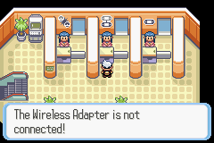
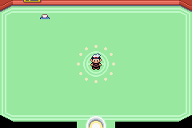

# Pokémon Ruby and Sapphire w/ Wireless Adapter

This is a modification of the pret's disassembly of Pokémon Ruby and Sapphire to implement Wireless Adapter functionality.
This project pulls code and assets from pret's [pokefirered](https://github.com/pret/pokefirered) and [pokeemerald](https://github.com/pret/pokeemerald) decompilations.

For pret projects, see [pret.github.io](https://pret.github.io/).

## Current Status

- Game detects whether the Wireless Adapter is connected
- Partial Emerald Union Room implementation

  
  
  

## Planned

- Emerald Cable Club Design and Scripts
- Trading and Battling with FireRed, LeafGreen, and Emerald over Wireless Adapter
- FrLg/E Wireless Glyph

---

### AI Assistance

Modifications to this decompilation project were implemented with assistance from Anthropic Claude. I specified the desired changes, directed and approved the implementation, and performed live testing and debugging. Claude analyzed the existing project files and generated the code changes under my direction.

The original decompilation work belongs to its respective contributors; these modifications do not claim authorship of the underlying project.
